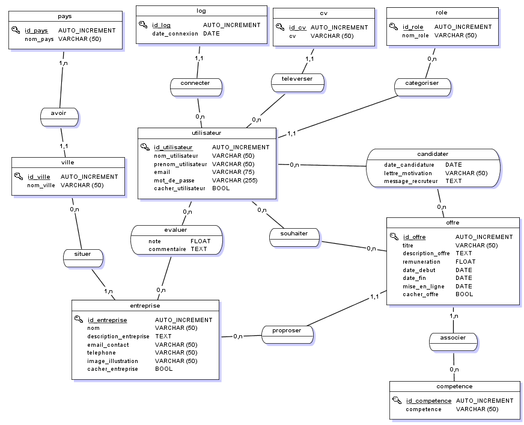
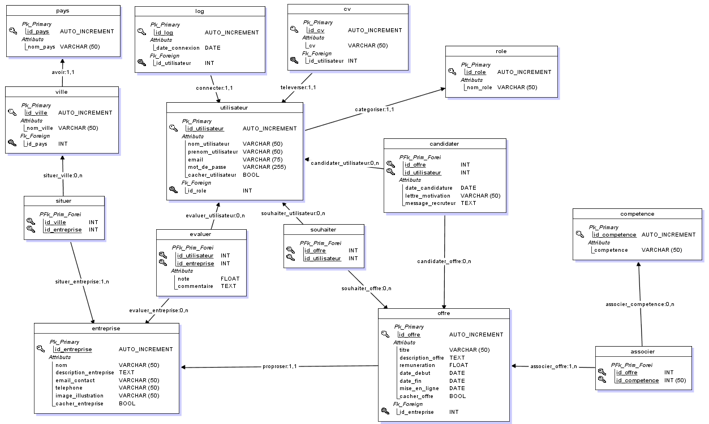

# ProjetDevWeb

Ce dépôt représente notre site web complet d'aide à la recherche de stage. Il permet de rechercher, poster et administrer des offres et entreprises pour des étudiants

# Sommaire

1. [Conception de la base de données](#conception-de-la-base-de-données)  
   - [Dictionnaire de données](#dictionnaire-de-données)  
   - [Modèle Conceptuel de Données (MCD)](#modèle-conceptuel-de-données-mcd)  
   - [Modèle Logique de Données (MLD)](#modèle-logique-de-données-mld)  

2. [Hiérarchie du projet](#hiérarchie-du-projet)  
   - [Répertoires principaux](#répertoires-principaux)  
   - [Fichiers principaux](#fichiers-principaux)  

3. [Présentation de l'interface du site](#présentation-de-linterface-du-site)
   - [Page de connexion](#page-de-connexion)  
   - [Page d'accueil](#page-daccueil)
   - [Page de recherche](#page-de-recherche)
   - [Page dashboard](#page-dashboard) 
   - [Page gestion des offres](#page-gestion-des-offres)  
   - [Page gestion des comptes](#page-gestion-des-comptes)  
   - [Page gestion des entreprises](#page-gestion-des-entreprises)  
   - [Page statistiques des offres](#page-statistiques-des-offres)  
   - [Page statistiques des entreprises](#page-statistiques-des-entreprises)  
   - [Page statistiques des étudiants](#page-statistiques-des-étudiants)  
   - [Page d'une offre](#page-dune-offre)  
   - [Page d'une entreprise](#page-dune-entreprise)  
   - [Page wishlist](#page-wishlist)  
   - [Page CV](#page-cv)  
   - [Page offres postulées](#page-offres-postulées)  

 
## Conception de la base de données

### Dictionnaire de données

Dans ce dictionnaire de données, vous trouverez tous les attributs de la base de données. Ce tableau permet de bien comprendre les données que nous avons besoins de stocker.

| **Nom de l'attribut**            | **Nom dans la base de données**     | **Type**         | **Taille** | **Tables**      |
|-----------------------------------|-------------------------------------|------------------|------------|-----------------|
| id_utilisateur                    | ID_UTILISATEUR                      | Auto_increment   |            | Utilisateur     |
| nom_utilisateur                   | NOM_UTILISATEUR                     | Varchar          | 50         | Utilisateur     |
| prenom_utilisateur                | PRENOM_UTILISATEUR                  | Varchar          | 50         | Utilisateur     |
| email                              | EMAIL                               | Varchar          | 75         | Utilisateur     |
| mot_de_passe                       | MOT_DE_PASSE                        | Varchar          | 255        | Utilisateur     |
| cacher_utilisateur                 | CACHER_UTILISATEUR                  | Bool             |            | Utilisateur     |
| id_entreprise                      | ID_ENTREPRISE                       | Auto_increment   |            | Entreprise      |
| nom                                | NOM                                 | Varchar          | 50         | Entreprise      |
| description_entreprise             | DESCRIPTION_ENTREPRISE              | Text             |            | Entreprise      |
| email_contact                      | EMAIL_CONTACT                       | Varchar          | 50         | Entreprise      |
| telephone                          | TELEPHONE                           | Varchar          | 50         | Entreprise      |
| image_illustration                 | IMAGE_ILLUSTRATION                  | Varchar          | 50         | Entreprise      |
| cacher_entreprise                  | CACHER_ENTREPRISE                   | Bool             |            | Entreprise      |
| id_offre                           | ID_OFFRE                            | Auto_increment   |            | Offre           |
| titre                              | TITRE                               | Varchar          | 50         | Offre           |
| description_offre                  | DESCRIPTION_OFFRE                   | Text             |            | Offre           |
| remuneration                       | REMUNERATION                        | Float            |            | Offre           |
| date_debut                         | DATE_DEBUT                          | Date             |            | Offre           |
| date_fin                           | DATE_FIN                            | Date             |            | Offre           |
| mise_en_ligne                      | MISE_EN_LIGNE                       | Date             |            | Offre           |
| cacher_offre                       | CACHER_OFFRE                        | Bool             |            | Offre           |
| id_competence                      | ID_COMPETENCE                       | Auto_increment   | 50         | Compétence      |
| competence                         | COMPETENCE                          | Varchar          | 50         | Compétence      |
| id_role                            | ID_ROLE                             | Auto_increment   |            | Rôle            |
| nom_role                           | ROLE                                | Varchar          | 50         | Rôle            |
| id_log                             | ID_LOG                              | Auto_increment   |            | Log             |
| date_connexion                     | DATE_CONNEXION                      | Date             |            | Log             |
| note                               | NOTE                                | Float            |            | Évaluer         |
| commentaire                        | COMMENTAIRE                          | Text             |            | Évaluer         |
| date_candidature                   | DATE_CANDIDATURE                    | Date             |            | Candidater      |
| lettre_motivation                  | LETTRE_MOTIVATION                   | Varchar          | 50         | Candidater      |
| message_recruteur                  | MESSAGE_RECRUTEUR                   | Text             |            | Candidater      |
| id_ville                           | ID_VILLE                            | Auto_increment   |            | Ville           |
| nom_ville                          | NOM_VILLE                           | Varchar          | 50         | Ville           |
| id_pays                            | ID_PAYS                             | Auto_increment   |            | Pays            |
| nom_pays                           | NOM_PAYS                            | Varchar          | 50         | Pays            |
| id_cv                              | ID_CV                               | Auto_increment   |            | CV              |
| cv                                 | CV                                  | Varchar          | 50         | CV              |

### Modèle Conceptuel de Données (MCD)

Ensuite, ce MCD (Modèle Conceptuel de Données) permet de représenter graphiquement les données et leurs relations dans le système d'information. Ainsi, nous avons réaliser ce schéma à l'aide de notre dictionnaire de données. Nous y avons modéliser nos tables qui vont contenir les données principales du site ainsi que le relations entre elles permettant aussi de voir l'interaction des tables entre elle. Ce dernier respecte la norme <a href="https://openclassrooms.com/fr/courses/6938711-modelisez-vos-bases-de-donnees/7561516-ameliorez-votre-modelisation-grace-aux-formes-normales" target="_blank">3NF</a>.
 
On peut voir que l'élément central est l'utilisateur. En effet, toutes les actions seront liées à ce dernier.

### Modèle Logique de Données (MLD)
Ensuite, nous avons choisi de transformer notre MCD en MLD (Modéle Logique de données) pour avoir une meilleure vision des clés étrangères entre les tables.

## Hiérarchie du projet

### Répertoires principaux

- `src/` : Contient les fichiers source (backend, logique de l'application)
  - `controller/` : Logique des contrôleurs
    - `Controller.php` : Classe de base pour les autres contrôleurs
    - `AuthController.php` : Gère les fonctionnalités d'authentification (connexion, déconnexion, inscription)
    - `DashboardController.php` : Gère la logique du tableau de bord utilisateur
    - `SearchController.php` : Gère les fonctionnalités de recherche
    - `SiteController.php` : Gère la logique générale du site (accueil, pages statiques)
    - `StatistiqueController.php` : Gère les statistiques et les données analytiques
  - `model/` : Contient les fichiers de gestion des données (modèles)
    - `Database.php` : Classe de gestion de la connexion à la base de données
    - `FileDatabase.php` : Classe pour la gestion des bases de données de type fichier
    - `Model.php` : Classe de base pour tous les modèles
    - `AuthModel.php` : Modèle pour gérer les données liées à l'authentification
    - `DashboardModel.php` : Modèle pour gérer les données du tableau de bord
    - `SearchModel.php` : Modèle pour gérer les données de recherche
    - `SiteModel.php` : Modèle pour gérer les données générales du site
    - `StatistiqueModel.php` : Modèle pour gérer les statistiques et les données analytiques

- `static/` : Contient les fichiers statiques (CSS, JS, images)
  - `css/` : Feuilles de style CSS
  - `js/` : Scripts JavaScript
  - `images/` : Images du projet

- `templates/` : Templates Twig ou autres moteurs de rendu
- `tests/` : Tests unitaires, fonctionnels et d'intégration
- `vendor/` : Dépendances gérées par Composer
- `public/` : Point d'entrée public pour le serveur

### Fichiers principaux

- `index.php` : Point d'entrée pour le serveur
- `composer.json` : Fichier de configuration des dépendances (pour Composer)
- `.gitignore` : Fichier pour ignorer les fichiers/dossiers dans Git
- `README.md` : Documentation du projet

## Présentation de l'interface du site

### Page de connexion

Sur cette page, l'utilisateur pourra se connecter. Il devra entrer son adresse mail ainsi que son mot de passe.

### Page d'accueil

Sur cette page, l'utilisateur verra une présentation du site ainsi que les dernières offres mises en ligne.

### Page de recherche

Cette page permet d'afficher toutes les offres et entreprises présentent sur le site. On peut aussi voir un système de pagination. Il y a aussi un bouton filtre qui permet de filtrer les offres et entreprises. Il y a aussi une barre de recherche.

### Page dashboard

Sur cette page, il y aura les pages d'administrations et de gestion pour les pilotes et les étudiants ainsi que l'administrateur.

### Page gestion des offres

Ici, on peut voir le formulaire pour créer une offre, avec les boutons de validation. On peut aussi voir un bouton pour voir les statistiques concernant les offres. En dessous, on peut voir le tableau de gestion des offres avec les boutons pour modifier ou supprimer.

### Page gestion des comptes

Sur cette image, on peut voir le formulaire de création de compte, l'administrateur peut créer n'importe quel compte tandis que le pilote peut créer que des comptes étudiants. On peut aussi voir les boutons de suppresion et de modification des comptes. Il y a aussi un bouton pour voir les statistiques des étudiants.   

### Page gestion des entreprises

Ici, on peut voir le formulaire pour créer une entreprise, avec les boutons de validation. On peut aussi voir un bouton pour voir les statistiques concernant les enrteprises. En dessous, on peut voir le tableau de gestion des entreprises avec les boutons pour modifier ou supprimer.

### Page statistiques des offres

Sur cette page, on peut voir plus d'information sur les offres.

### Page statistiques des entreprises

Sur cette page, on peut voir plus d'information sur les entreprises.

### Page statistiques des étudiants

Sur cette page, on peut voir plus d'information sur les étudiants.

### Page d'une offre

Sur cette page, on peut postuler à une offre pour les étudiants et les administrateurs, la modifier ou la supprimer pour les pilotes et les administrateurs.

### Page d'une entreprise

Sur cette page, on peut noter une entreprsie pour tous les utilisateurs, la modifier ou la supprimer pour les pilotes et les administrateurs.

### Page wishlist

Sur cette page l'étudiant peut consulter ses offres en wishlist.

### Page CV

Sur cette page l'étudiant peut consulter ses CVs.

### Page offres postulées

Sur cette page l'étudiant peut consulter les offres auxquelles il a postulé.

